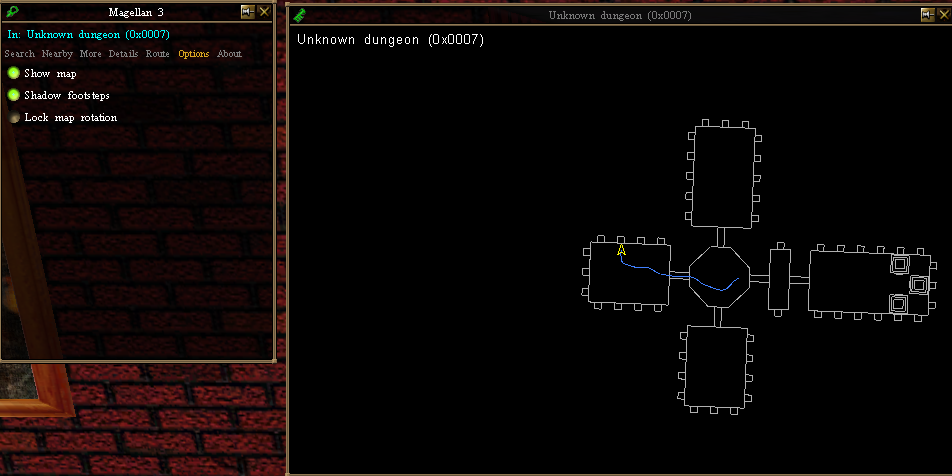

# Magellan 3

A 2026 rebuild of **Magellan 2** (Adam Wright, 2003) for **Decal 3** on the **End-of-Retail**
Asheron's Call client: a places database, dungeon identification, on-screen coordinates, and a
live dungeon automap and breadcrumb trail generated from the client's own DAT geometry.

The original was a native ATL/COM plugin that drew with GDI onto a device context Decal handed it.
That device context, that DAT format, and that plugin contract are all gone. This is a clean
reimplementation on the modern managed stack — but it starts from the original's data, window, and
algorithm, all recovered from the 2003 binary and verified against independent sources.




## Why it exists

GoArrow already does places and dungeon maps — but its dungeon maps are raster images downloaded
from a CDN that no longer exists. Magellan **generates** its map from `client_cell_1.dat` at
runtime, so it works offline and maps custom ACE-server dungeons nobody has ever drawn. That is the
differentiator; nostalgia is not.

## Layout

```
Magellan3.sln
├── src/
│   ├── Magellan3.Core/        netstandard2.0 — PURE logic, zero dependencies, fully tested
│   │   ├── World/Coords.cs         landcell <-> Dereth coordinates (verified to a half-cell)
│   │   ├── Data/PlacesDb.cs        places.xml loader: search + radius query + errata
│   │   ├── Data/DungeonNames.cs    653 landblock -> dungeon-name lookups
│   │   ├── Mapping/OutlineBuilder  landblock-scoped floor-outline extraction (the seam fix)
│   │   ├── Mapping/AutomapRenderer heading-up projection + Z-slice (the rotation fix)
│   │   └── Config/Settings.cs      the 2003 config.xml format, round-tripped
│   └── Magellan3.Plugin/      net48, x86 — the Decal glue (Windows-only)
│       ├── PluginCore.cs           PluginBase; events, /mag command, view control wiring
│       ├── Mapping/DatSource.cs    FileService + offline DAT access (+ the phase check)
│       ├── Mapping/DungeonMapper   the recovered algorithm, driving OutlineBuilder
│       ├── Ui/DxCanvas.cs          IMapCanvas over VVS DxTexture
│       ├── Ui/MapOverlay.cs        borderless heading-up HUD, bake-once/blit-per-frame
│       ├── VirindiViews/           MetaViewWrappers shim (MIT, from Mag-nus/DecalPluginTemplates)
│       └── Resources/mainView.xml  the RECOVERED view, verbatim, embedded
├── tests/Magellan3.Tests/     net8.0 — 59 tests, no packages, runs anywhere
├── data/                      places.xml · dungeon_names.tsv · mainView.xml
└── run-tests.sh               offline test runner (no NuGet feed needed)
```

The dependency arrow points one way: `Core` knows nothing about Decal, VVS, or DatReaderWriter.
Everything that can be tested without a game is in `Core`, and it is.

## Test

```bash
./run-tests.sh        # 59/59, no NuGet feed required
```

Or, with a feed available:

```bash
dotnet test           # once tests/Magellan3.Tests is restored normally
```

The suite pins the things that were wrong or unknowable before, to ground truth that has nothing to
do with Magellan: the coordinate transform against the four `<LOC>` records and the Aphus Lassel
landblock; the `COORD_X`/`COORD_Y` axes against a 2002 third-party location list; the automap's
heading rotation against a "face east, a point due east must render ahead" check; and the
floor-outline seam-cancellation against a two-cell room that must read as one outline, not two boxes.

## Install (for users)

**Prerequisites** (install these first — Magellan does not bundle them):

- **Asheron's Call**, an **End-of-Retail** client (the automap reads its `client_cell_1.dat`).
- **Decal 3** (2.9.8.3) — the plugin framework.
- **VirindiViewService (VVS)** — the UI/drawing toolkit the map and window use.

**Then install Magellan 3:**

1. Download the latest release archive from the [Releases](../../releases) page and unzip it. It
   contains everything you need:
   - `Magellan3.dll` — the plugin
   - `Magellan3.Core.dll` — its logic library
   - `DatReaderWriter.dll` — the DAT reader (for the automap)
   - `places.xml`, `dungeon_names.tsv`, `places_2.0.0.2.xml` — the places, dungeon-name, and routing data
2. Put **all of those files together** in one folder (e.g. `C:\Games\Magellan3\`). They must sit
   side by side — the plugin loads the data files from beside the DLL, and won't work with just the DLL.
3. Register the plugin (magellan3.dll) with Decal.
4. Enable **Magellan 3** in Decal's plugin list, then launch AC.
5. The Magellan window opens from its icon in the VVS bar. Search a place, enter a dungeon to see
   the automap, or run `/mag diag` to check status.

Settings you change (Show map, footsteps, lock rotation) are saved automatically to
`%AppData%\Magellan3\config.xml` and persist across logins.

## Build from source (Windows)

Requires Visual Studio / `dotnet` on Windows, an installed Decal 3 and VVS, and an EoR client.

1. Edit the three `HintPath`s in `src/Magellan3.Plugin/Magellan3.Plugin.csproj` to point at your
   installed `Decal.Adapter.dll`, `Decal.FileService.dll`, and `VirindiViewService.dll`.
2. `dotnet build src\Magellan3.Plugin\Magellan3.Plugin.csproj -c Release` (or build the solution in
   VS; the plugin is `Release|x86`). `Chorizite.DatReaderWriter` restores from NuGet. The build copies
   the three data files (`places.xml`, `dungeon_names.tsv`, `places_2.0.0.2.xml`) next to the DLL.
3. Copy `Decal.Adapter.dll`, `Decal.FileService.dll`, and `VirindiViewService.dll` next to the built
   `Magellan3.dll`, then register with the **32-bit** RegAsm as Administrator, from `bin\Release`:
   ```
   C:\Windows\Microsoft.NET\Framework\v4.0.30319\RegAsm.exe /codebase Magellan3.dll
   ```
4. Enable **Magellan 3** in Decal's Manage Plugins UI, then launch AC.
5. In-game, run **`/mag diag`** for status, or **`/mag phase`** to verify the DAT read (see below).

The automap is on by default (`MAGELLAN_AUTOMAP` in `<DefineConstants>`); the logic layer is covered
by `run-tests.sh` (67 tests), which runs on any platform without Decal, VVS, or NuGet.

### One thing to verify in-game, once

DatReaderWriter's `Unpack` reads a leading id DWORD for `HasId` records (EnvCell, Environment,
LandBlockInfo all qualify). Whether Decal's `FileService.GetCellFile` returns that header or strips
it decides a 4-byte parse phase. On first run, confirm and set:

```csharp
byte[] b = CoreManager.Current.FileService.GetCellFile(knownCellId);
DecalDatSource.FileServiceIncludesIdHeader = DecalDatSource.HeaderPresent(b, (uint)knownCellId);
```

If it comes back wrong, geometry silently decodes into plausible garbage — so prove it once. See the
note in `Mapping/DatSource.cs`.

## Feature status — all working in-game

| Feature | State |
|---|---|
| Places database + search (3,307 entries) | **done, working in-game** |
| Click a result → coordinates in chat | **done, working in-game** |
| Dungeon identification (653 names) | **done, working in-game** |
| Always-on coordinate readout (top of window) | **done, working in-game** |
| Route finding (149-portal Dijkstra) | **done, working in-game** |
| Automatic dungeon mapping (the automap) | **done, working in-game** — reads `client_cell_1.dat` at runtime |
| Footstep trail (Z-sliced by floor) | **done, working in-game** |
| Settings persist across logins | **done** — saved to `%AppData%\Magellan3\config.xml` |

Every original Magellan 2 feature is present, plus a 653-name dungeon database (vs the original's
117), Z-sliced trails, and an About tab. The full logic layer is unit-tested (`run-tests.sh`, 67
tests). The one thing that differs from the original by necessity: the on-screen coordinate readout
lives at the top of the plugin window rather than as a separate floating overlay (a second VVS
window proved unstable on the current client).

## Credits

- **Adam Wright** — Magellan 2 (2003): the original places database, window, and automap algorithm.
- **ACCPP (Immortalbob)** — the 2026 resurrection: reverse-engineering the 2003 binary and rebuilding the
  whole plugin on the modern Decal 3 / End-of-Retail managed stack.
- **Chorizite** — `DatReaderWriter` (MIT): the DAT parsing.
- **DungeonViewer** authors — `dungeons.dvp` (653 dungeon names) and the DM→ToD format deltas, used
  as documentation.
- **Virindi Plugins / Mag-nus** — VirindiViewService and the MetaViewWrappers template.

## License

Released under the [MIT License](LICENSE).

`DatReaderWriter` (bundled at runtime) is also MIT-licensed by Chorizite. Decal and VirindiViewService
are separate installs with their own terms and are not distributed here.
